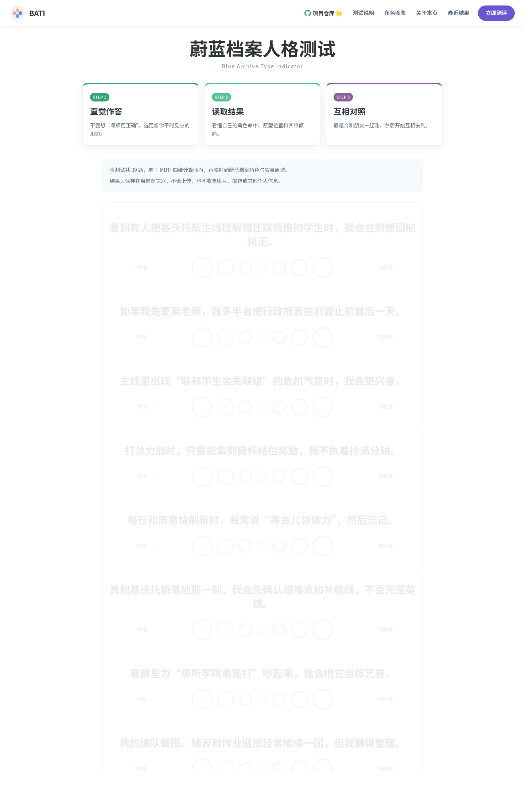

<div align="center">

# BATI

**B · A · T · I — Blue Archive Type Indicator**

一个以蔚蓝档案角色为主题的 MBTI 风格同人测试站点

回答情境式问题 → 命中唯一角色结果 → 查看你的蔚蓝档案人格原型

[在线体验](https://ryujou.github.io/bati/) · [开始贡献](#贡献) · [阅读文档](#工作原理)

> ⚠️ 本工具仅作娱乐用途，不作为心理诊断、医学评估或现实人格结论。

</div>

---

## 截图预览

<p align="center">
  
  &nbsp;
  
  &nbsp;
  
</p>

## 特性

- **MBTI 四维判定** — 以 E/I、S/N、T/F、J/P 四维倾向作为底层框架
- **8 种叙事原型** — 影面策士 · 冰面观察者 · 誓约队长 · 灵巧回旋者 · 温柔修复者 · 月下守护者 · 发光主角位 · 混沌火花
- **16 位蔚蓝档案角色** — 当前版本收录 16 位学生，并映射到不同 MBTI 与角色气质
- **维度可视化** — 结果页展示四维倾向比例与命中结果
- **分享导出** — 支持复制结果文案与导出分享海报
- **纯前端运行** — 无后端、无注册、无数据收集，结果仅保存在本地浏览器
- **可扩展图像生成流程** — 内置 Blue Archive 参考图抓取、16Personalities 风格抓取与 Gemini 出图脚本

## 在线体验

**[https://ryujou.github.io/bati/](https://ryujou.github.io/bati/)**

当前部署于 **GitHub Pages**，由 GitHub Actions 自动构建与发布。

## 贡献

欢迎 **Star** · 欢迎 **Issue** · 欢迎 **PR**。

如果你想继续扩充 BATI，这几个位置最常改：

- 补充或调整角色：编辑 `src/data/characters.json`
- 调整题库与语境题：编辑 `src/data/questions.json`
- 修改角色视觉映射：编辑 `src/data/characterVisuals.json`
- 修复页面或交互：直接提交 PR
- 调整结果算法：查看 `src/utils/quizEngine.ts`

仓库已配置 GitHub Actions CI，会在 `push` 到 `main` 和所有 PR 上自动执行 `npm ci` 与 `npm run build`，确保静态站点能够正常构建。

## 技术栈

<p align="center">
  
  
  
  
  
  
</p>

## 项目结构

```text
src/
├── components/                  # 可复用 UI 组件
│   ├── AppIcon.vue
│   ├── ProgressBar.vue
│   ├── QuestionCard.vue
│   ├── ResultSummary.vue
│   ├── SharePoster.vue
│   └── AdsenseSlot.vue
├── composables/                 # Vue 组合式函数
│   ├── useQuiz.ts               # 测试状态与逻辑
│   └── useShare.ts              # 分享与导出
├── data/                        # 静态数据
│   ├── questions.json           # 39 道题目
│   ├── archetypes.json          # 8 个原型定义
│   ├── characters.json          # 16 位角色资料
│   ├── characterVisuals.json    # 角色视觉配置
│   └── characterProbabilities.json
├── i18n/                        # 文案与多语言结构
├── pages/                       # 页面组件
│   ├── HomePage.vue
│   ├── IntroPage.vue
│   ├── QuizPage.vue
│   ├── ResultPage.vue
│   ├── CharactersPage.vue
│   └── AboutPage.vue
├── router/
│   └── index.ts                 # 路由配置
├── utils/                       # 核心逻辑与工具
│   ├── quizEngine.ts
│   ├── characterVisuals.ts
│   ├── characterProbability.ts
│   ├── adsense.ts
│   └── storage.ts
├── App.vue
├── main.ts
└── style.css

scripts/
├── fetch_ba_wiki_refs.mjs       # 抓取 Blue Archive 角色参考图
├── fetch_16p_style_refs.mjs     # 抓取 16Personalities 风格参考图
├── generate_gemini_mbti_images.mjs
├── audit-reachability.mjs
└── probability-simulation.mjs
```

## 工作原理

```text
答题（39 道七级量表题）
→ 四维算分（E/I、S/N、T/F、J/P）
→ 原型匹配（8 种叙事原型）
→ 角色命中（输出唯一主角色）
→ 结果展示（角色、原型、维度比例、分享内容）
```

1. **答题** — 39 道七级量表题，按情境作答
2. **算分** — 按维度和题目权重累加，得到四维倾向比例
3. **原型匹配** — 将四维结果映射到 8 种叙事原型
4. **角色命中** — 在角色库中匹配最接近的主角色
5. **结果展示** — 输出角色结果、原型解析、维度条和分享内容

## 本地开发

```bash
# 安装依赖
npm install

# 启动开发服务器
npm run dev

# 构建
npm run build
```

构建产物输出到 `dist/`，当前配置为相对路径，可直接部署到 GitHub Pages 等静态托管平台。

## 图像生成

仓库内置了参考图抓取和 Gemini 出图脚本：

```bash
node scripts/fetch_ba_wiki_refs.mjs hina aru
node scripts/fetch_16p_style_refs.mjs INTJ ENTP
HTTP_PROXY=http://127.0.0.1:7890 HTTPS_PROXY=http://127.0.0.1:7890 GEMINI_API_KEY=你的密钥 node scripts/generate_gemini_mbti_images.mjs hina aru
```

- `fetch_ba_wiki_refs.mjs` 会抓取 Blue Archive 角色参考图
- `fetch_16p_style_refs.mjs` 会抓取 16Personalities 官方风格参考图
- `generate_gemini_mbti_images.mjs` 会结合风格参考和角色参考，用 Gemini 生成结果图并写回 `src/data/characterVisuals.json`
- 当前图像生成默认支持本地代理 `http://127.0.0.1:7890`
- 当前仓库中的角色结果图为 **Gemini** 结合 Blue Archive 原始立绘参考图与本地风格参考图生成

## 持续集成与部署

- **GitHub Actions CI**：在 `main` push / PR 时校验构建是否通过
- **GitHub Pages**：负责自动部署静态站点
- **GitHub Release**：在推送 `v*` tag 时自动构建 `dist/`、打包 zip，并创建 Release

发版方式示例：

```bash
git tag v0.1.0
git push origin v0.1.0
```

## 内容数据

| 文件 | 说明 |
|:-----|:-----|
| `src/data/questions.json` | 39 道情境式题目 |
| `src/data/archetypes.json` | 8 个叙事原型定义 |
| `src/data/characters.json` | 16 位角色资料与映射 |
| `src/data/characterVisuals.json` | 角色视觉资源与主题色 |
| `src/data/characterProbabilities.json` | 角色命中概率数据 |

## 致谢与来源

- **界面风格灵感** — 参考自 [16personalities](https://www.16personalities.com/) 的扁平化测评表达
- **项目来源说明** — 本项目的早期页面结构灵感参考自开源项目 [ACGTI](https://github.com/tianxingleo/ACGTI)
- **角色结果图** — 当前版本的角色图由 **Gemini** 基于参考图流程生成
- **当前仓库定位** — BATI 是独立维护的蔚蓝档案二次创作版本，不跟踪上游，也不是原仓库的 fork

## 产品边界

- 纯静态前端，无后端服务、无用户系统、无数据库
- 不作为心理诊断或医学评估工具
- 测试结果保存于浏览器 localStorage
- 不收集个人账号或隐私信息
- `Blue Archive / 蔚蓝档案` 相关角色与设定版权归原作方所有

<div align="center">

---

**[⬆ 回到顶部](#bati)**

</div>
